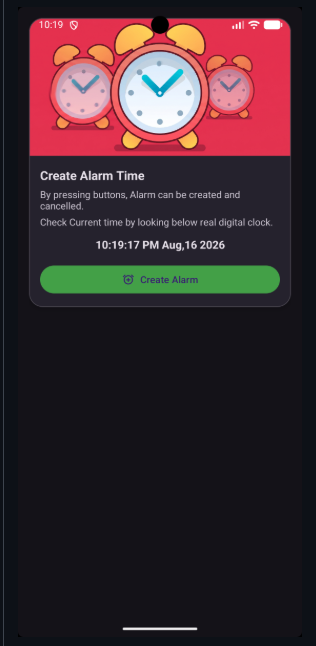
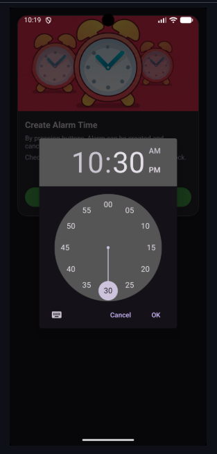
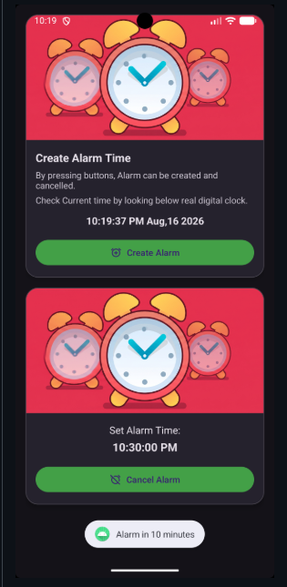
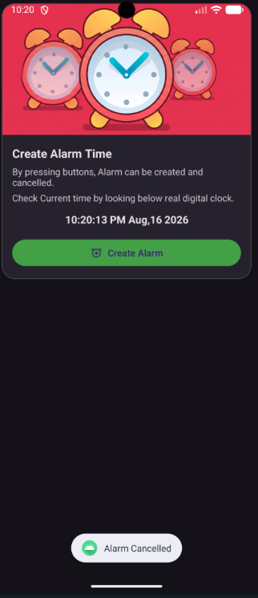

# Practical-4

**Aim:** Create an Android Alarm application using **Service** and **BroadcastReceiver**.

## Project Description

This application demonstrates how an Android alarm can be scheduled using the `AlarmManager` and how background tasks can be handled using a `Service` and a `BroadcastReceiver`.

### Key Components:

- **MainActivity:** Provides the user interface and allows the user to select an alarm time using `TimePickerDialog`.
- **AlarmManager:** Schedules the alarm to trigger at the selected time.
- **AlarmBroadcastReceiver:** Receives the alarm event from `AlarmManager` and starts the `AlarmService`.
- **AlarmService:** Handles the alarm ringtone using `MediaPlayer` and continues playing the alarm until it is stopped.
- **Material Design UI:** Uses components such as `MaterialCardView`, `MaterialButton`, and `TextClock` to create a simple and responsive interface.

## Screenshots

| **Main UI** | **Time Picker** | **Alarm Set** |
|:---:|:---:|:---:|
|  |  |  |

| **Alarm Ringing** |
|:---:|
|  |
